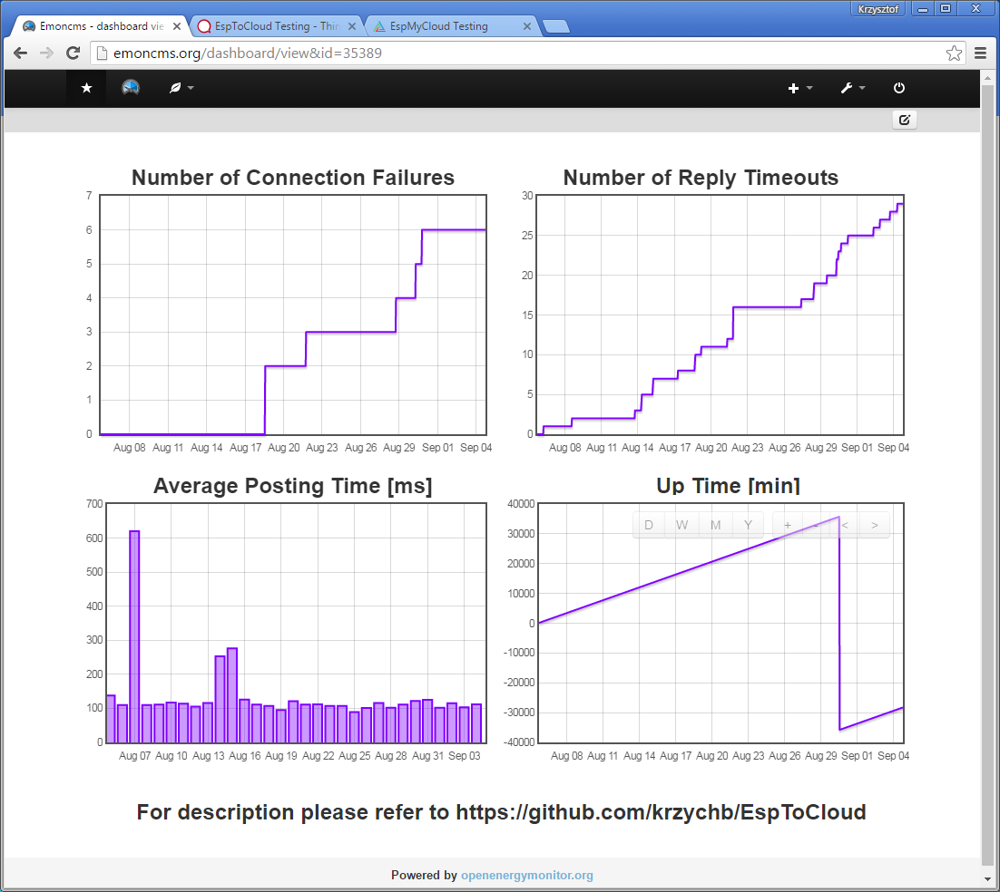

# EspToCloud [](https://travis-ci.org/krzychb/EspToCloud)

A collection of code snippets I am using frequently to post data from ESP8266 to the cloud for storage, visualization and analysis.


## Table of Contents
- [Introduction](#introduction)
- [Functionality](#functionality)
- [Installation](#installation)
- [Application](#application)
  - [Emoncms](#emoncms)
  - [ThingSpeak](#thingspeak)
  - [Keen IO](#keen-io)
  - [All Together](#all-together)
- [Compatibility](#compatibility)
  - [Hardware](#hardware)
  - [Arduino Core](#arduino-core)
  - [Programming Environment](#programming-environment)
- [Contribute](#contribute)
- [Credits](#credits)
- [License](#license)


## Introduction

When doing projects with ESP8266 I often need to collect and analyse some data. For instance process variables as humidity or temperature like in [OnlineHumidifier](https://github.com/krzychb/OnlineHumidifier) project. On other occasion I may need to record and compare up time as well as performance parameters for couple of ESP8266 modules running various versions of similar application as in [EspFire2012](https://github.com/krzychb/EspFire2012) project. 

In cases like that, instead of developing storage and analysis tools on my own, it may be much easier, quicker and convenient to use external cloud service. There are several services like that fitted with tested and ready to use tools to store, visualize and analyze the data.

Below is summary of three cloud services I am using on my projects together with sample sketches. 

## Functionality

Each sketch is posting the following variables to respective cloud service:

* sketch up time in minutes : `EspCloud_UpTime`
* free heap size reported by module in bytes : `EspCloud_HeapSize`
* number of transmission attempts to the cloud service : `EspCloud_TransmissionAttempts`
* number of reply timeouts by the cloud service : `EspCloud_ReplyTimeouts`
* number of connection failures : `EspCloud_ConnectionFailures`
* time in milliseconds that took to transmit the data and obtain a reply from the service in previous post request : `EspCloud_PostingTime`


## Installation

To make particular sketch running you need to:

1. Set up an account is selected cloud service.

2. Copy and paste an API key provided by the service (it typically looks like `9a3e3c9cf65c70a597097b065dcb24e3`) to the sketch in the following line:

 ```cpp
  #define API_KEY "enter-your-api-key-here"
 ```
 
3. For Keen IO you will also need to update request url (it looks like `/3.0/projects/5359bcb513e406c26c910dac/events/esp`) in the following line:

 ```cpp
  #define REQUEST_URL "enter-your-KeenIO-request-url-here"
 ```
 
4. Enter SSID and password to your Wi-Fi network (instead of `********`, see below), so the module can join the network:

 ```cpp
  const char* ssid = "********";
  const char* password = "********";
 ```
 
5. Optionally you can change line below that defines how often data are posted to the cloud. Default value is 60000 milliseconds (60s).
 
 ```cpp
  #define UPDATE_PERIOD 60000
 ```
 
Once ready load sketch to the module. Open serial monitor to check if module has joined Wi-Fi network. Then each time the `UPDATE_PERIOD` elapses, you should repeatedly see a messages confirming that data are posted to the cloud.


## Application

The following chapters contain my thoughts on using three cloud services. They contain screenshots of dashboards with actual data collected during testing. Summary of testing is provided at the end.


### Emoncms

The first cloud service I have tried and adopted to my needs is [Emoncms](http://emoncms.org/). It is optimized for processing, logging and visualizing energy, temperature and other environmental data. I am using it quite frequently for all sorts of data, also those not mentioned by Emoncms, and found this service very quick and reliable. Once I had an issue with posting data and [reported](https://community.openenergymonitor.org/t/all-my-feeds-stopped-recording-data-on-emoncms-org/828) it on the forum. It was resolved within less than 12 hours what I really like. Did I mention it is a free service? Excellent job Emoncms team!



What I like about [Emoncms](http://emoncms.org/):
* Data posting up to every 10s, quick and concise "OK" reply after each successful data transmission
* Handy dashboard with various containers, widgets and visualizations to organize and show my data
* Ability to show several variables on a single "multigraph" chart

What can be improved?
* Provide possibility to generate new API keys
* Add more possibility to show links and graphics on dashboard

Check example [sketch](EspToCloud-Emoncms/EspToCloud-Emoncms.ino) how to post data to [Emoncms](http://emoncms.org/).

On line dashboard with the data charts - http://emoncms.org/dashboard/view&id=35389


### ThingSpeak

When browsing IoT projects on internet, you may find a lot of screen shots of charts created with [ThinkSpeak](https://thingspeak.com/). That finally attracted me to trying this service as well. I quickly realized that ThinkSpeak makes it really easy to post and visualize data. There are a lot of configuration options to customize number of points displayed, do data averaging, change charts titles and colors, etc. What I did not like was lack of possibility to display more than a single variable on a chart. Finally I have noticed and pressed "MATLAB Visualization" button and got totally amazed. ThinkSpeak provides access to wealth of features of MATLAB. If you have to do some processing of data before showing them off then ThinkSpeak is a tool for you. You will get access to MATLAB engine to do anything you need to do with the data, and to show the data on-line on almost any [chart or plot](http://www.mathworks.com/products/matlab/plot-gallery.html?refresh=true) you may think of. I have also tried contacting support and my issue with deleting unused channels was resolved within couple of days. Did I mention that use of ThinkSpeak including MATLAB to crank and visualize your data is free? 


What I like about [ThinkSpeak](https://thingspeak.com/):
* MATLAB to process and visualize data
* User friendly interface to instantly show the data on charts
* Templates to quickly start with MATLAB® Visualization

What can be improved?
* Rigid dashboard to show charts on fixed size grid
* Fixed number of up to eight fields per channel

Check example [sketch](EspToCloud-ThingSpeak/EspToCloud-ThingSpeak.ino) how to post data to [ThinkSpeak](https://thingspeak.com/).

On line dashboard with the data charts - https://thingspeak.com/channels/130476


### Keen IO

I got aware of this service because of [Keen IO](https://twitter.com/keen_io) liking my tweets. Then I got intrigued by Keen IO's ads offering API for analytics and pop-ups inviting to ask for support whenever I visited https://keen.io/. I did not have any attractive IoT project involving data analytics and put this one for later. Finally I decided study API documentation and after some testing with [cURL](https://en.wikipedia.org/wiki/CURL) I managed to post data to KeenIO's cloud. With this service you will be able to post data for free with rate of about once per a minute (50,000 per month). To post faster you need to pay. According to [Product / Plans](https://keen.io/plans/self-service/), as of August 2016, you may post 15,000,000 events per month for $1,000 (almost 6 times per second). Events are recorded as individual JSON objects and documentation provides extensive [API](https://keen.io/docs/api/) to manage the data. This is including [data enrichment](https://keen.io/docs/api/#data-enrichment) to e.g. associate a client’s IP address with geographical location of the client when the event was recorded. "Out of the box" visualization is provided on a *Dashboard* with the *Explorer* to set up basic charts and metrics. I tried once to use offered support and ask what charts I can get using *Dashboard* /*Explorer*. Nobody contact me back but I have managed to do it myself. I assume hobbyists are not the target customers. Feature rich data [analysis](https://keen.io/guides/tags/data-analysis/) and [visualization](https://keen.io/guides/tags/data-visualization/) is available using Keen IO’s [SDK's](https://keen.io/docs/sdks/). It is provided for several platforms / languages that you need to integrate with your system by yourself.


What I like about [Keen IO](https://keen.io/):
* Extensive API to manage data
* Extensive SDK to analyse and visualise data
* Wide range of event collection plans

What can be improved?
* Limited options to visualize data with *Dashboard* / *Explorer*
* Missing option to export data from the control panel

Check example [sketch](EspToCloud-KeenIO/EspToCloud-KeenIO.ino) how to post data to [Keen IO](https://keen.io/).


### All Together

To provide some indication what to expect from a cloud service for free, out of [collected parameters](#functionality) I have compared the following three:

* number of connection failures : `EspCloud_ConnectionFailures`
* number of reply timeouts by the cloud service : `EspCloud_ReplyTimeouts`
* time in milliseconds that took to transmit the data and obtain a reply from the service in previous post request : `EspCloud_PostingTime`

Table below contains data collected over the period of 15 days from 5 till 20 August 2016.

| Parameter / Cloud Service | Emoncms | ThingSpeak | Keen IO |
| :---: | :---: | :---: | :---: |
| Number of Connection Failures | 2 | 2 | 6 |
| Number of Reply Timeouts | 11 | 32 | 186 |
| Average Posting Time [ms] | 140 | 430 | 730 |

The data have been posted by a single ESP8266 module using [this sketch](EspToCloud-All/EspToCloud-All.ino) to [Emoncms](http://emoncms.org/), [ThinkSpeak](https://thingspeak.com/) and [Keen IO](https://keen.io/). Positing period was 60 seconds for each application so individual services were contacted every 20 seconds. Module was running patiently and continuously without any restarts so I decided to picture it below. 


More information about used h/w and compatible s/w is provided in chapter [Compatibility](#compatibility).


### Summary

It is a lot of fun to work with each of above cloud services. They are crafted with heart and creativity. Each service has something unique to offer. Emoncms provides versatile dashboard with many visualizations, ThinkSpeak has unique MATLAB support, Keen IO is for bigger players that need custom data processing and visualization supported with extensive SDK. You have options to select one that fits you better and for free.


## Compatibility

All sketches have been developed and tested using the following hardware and system software.


### Hardware

* NodeMCU 1.0 (ESP-12E Module)


### Arduino Core

* [Esp8266 / Arduino](https://github.com/esp8266/Arduino) core [2.3.0](https://github.com/esp8266/Arduino/releases/tag/2.3.0) for Arduino IDE and Visual Micro
* [framework-arduinoespressif](http://platformio.org/platforms/espressif) version 13 for PlatformIO


### Programming Environment

* [Arduino IDE](https://www.arduino.cc/en/Main/Software) 1.6.9 portable version running on Windows 7 x64
* [PlatformIO IDE](http://platformio.org/platformio-ide) 1.3.0 CLI 2.11.0 running on Windows 7 x64
* [Visual Micro](http://www.visualmicro.com/) 1606.17.10 with Visual Studio Community 2015 running on Windows 7 x64


## Contribute

Feel free to contribute to the project in any way you like!

If you find any issues with code or description please report them using *Issues* tab above.


## Credits

Software for this project has been prepared thanks to applications prepared by the following teams and individuals:
* esp8266/Arduino team lead by [Ivan Grokhotkov](https://twitter.com/i_grr) that brought to us excellent [ESP8266 core for Arduino](https://github.com/esp8266/Arduino).
* Arduino team that develops and maintains versatile [Arduino IDE](https://www.arduino.cc/)
* PlatformIO team lead by [Ivan Kravets](https://twitter.com/ikravets) that develops and maintains quick, modern and versatile [PlatformIO](http://platformio.org/) that is an open source ecosystem for IoT development.
* [VisualMicro](http://www.visualmicro.com/) that provides excellent Arduino IDE for Microsoft Visual Studio and Atmel Studio.

This repository could not be created without the following great cloud services that you can use for free:
* [Emoncms](http://emoncms.org/) - A powerful open-source web-app for processing, logging and visualising energy, temperature and other environmental data.
* [ThinkSpeak](https://thingspeak.com/) - An open source data platform and API for the Internet of Things.
* [Keen IO](https://keen.io/) - With Keen IO’s developer-friendly APIs, it’s easy to collect, explore, and visualize data anywhere. Apps and websites, customer-facing dashboards, IoT devices, you name it.


## License

[GNU LESSER GENERAL PUBLIC LICENSE - Version 2.1, February 1999](LICENSE)

